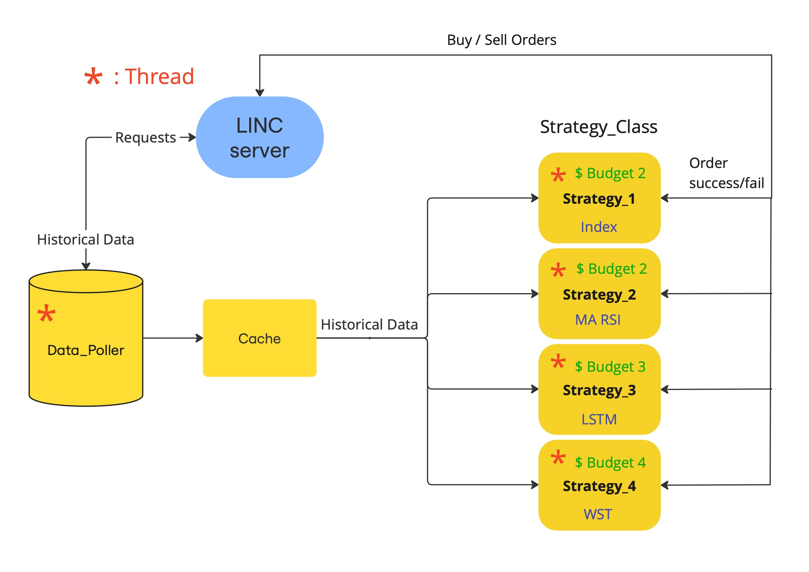

# Algo-rythmics - LINC-STEM Algorithmic Trading Hackathon 2025

## 🥇 Scored first place by the judges (Nordea, SEB)

We were a randomly assigned team of 4 students of varying background and experiences and we implemented this repo in the span of 3 days after the broker platform API and historical dummy data was announced by LINC-STEM. 

Strategy: we had limited time, but in preparation for the hackathon trading day we set out to:

1. Implement a multithreaded trading platform (required)
2. Implement and backtest trading strategies of increasing complexity (as many as we want)
3. Implement the trading strategies into the platform (required)
4. Validate that everything works before the trading simulation starts (required)

### Flowchart of the implemented multi-threaded trading platform

* 4 different trading strategies were implemented and assigned a thread each
* A trading strategy is a concurrent process sending buy/sell orders to the LINC api following a certain rule that it is checking a certain frequency
* The platform gave the user control to activate/deactivate a strategy live during the simulation and allowed the user to tweak parameters (such as stoploss)
* Data_Poller is a concurrent process retrieving stock data from the ongoing simulation at a certain frequency and providing it to the strategies

### Presentation

You can look at it here: https://docs.google.com/presentation/d/1uylVYmHuu4b8RpB8PlmvWKa2T58gsKRMJH91QivrW70/edit?usp=sharing 

## Repo structure

The repo strucutre is kind of a mess (due to limited time and varying degrees of experiences in Git) but loosely you will find...

`manual_handling.ipynb` - the file we used in the live scenario

`given_resources` all info we got from LINC-STEM prior to the event

`paddy` - the trading platform, LSTM trading strategy

`eliot` - index trading strategy, experimental WST trading strategy

`dag` - a moving average momentum trading strategy

`Douglas` - a moving average momentum trading strategy

### requirements.txt and setup.sh

Mac/Linux: Create virtual python env in python 3.10 and install python packages automatically by running "./setup.sh". You need to have Python 3.10 installed on your computer first! 

